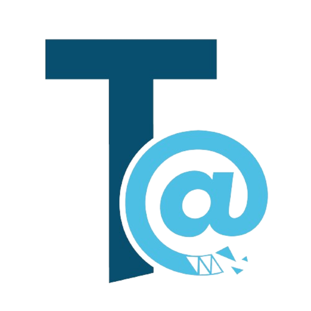

<p align="center">
  
</p>

# TecnoTáctil — Descargas oficiales

**TecnoTáctil** hace soluciones digitales pensadas para Cuba: programas que
**funcionan sin internet** y se sincronizan solos cuando vuelve la conexión.
Este es el repositorio oficial de descargas de todas nuestras aplicaciones —
las de pago **y las que regalamos a la comunidad**.

🌐 Web oficial: **[www.tecnotactil.com](https://www.tecnotactil.com)**
💬 Soporte y comunidad: **[t.me/tecnotactil_ia](https://t.me/tecnotactil_ia)** (Telegram)

---

## 📦 Todos los programas

| Programa | Qué hace | Descargar | Licencia |
|---|---|---|---|
| **TecnoTáctil Negocio** (escritorio) | Punto de venta y gestión completa del negocio: ventas, caja, inventario con kardex, contabilidad, reportes ONAT, usuarios con permisos. Funciona 100 % sin internet. | [Windows](https://github.com/tecnotactil-ia/tecnotactil-tpv-descargas/raw/main/escritorio/TecnoTactil_Negocio.exe) (7 a 11) · [Linux](https://github.com/tecnotactil-ia/tecnotactil-tpv-descargas/raw/main/escritorio/TecnoTactil_Negocio_linux.tar.gz) | ✅ Con licencia · 15 días de prueba gratis |
| **TecnoTáctil Negocio** (Android) | La administración del negocio en el teléfono: catálogo, inventario, facturas, reportes. Se sincroniza con el escritorio. | [APK](https://github.com/tecnotactil-ia/tecnotactil-tpv-descargas/raw/main/android/TecnoTactil_Negocio.apk) | ✅ Con licencia · 15 días de prueba gratis |
| **TecnoTáctil Caja** (Android) | La caja para los dependientes: cobra en CUP, USD o EUR con vuelto calculado, arqueo por divisa. Las ventas se sincronizan solas con el PC. | [APK](https://github.com/tecnotactil-ia/tecnotactil-tpv-descargas/raw/main/android/TecnoTactil_Caja.apk) | ✅ Con licencia (la misma del negocio) |
| **Bajar Vídeos** 🎁 | Descarga vídeos de YouTube y muchos sitios más, en MP4 y con playlists completas. | [Windows](https://github.com/tecnotactil-ia/tecnotactil-tpv-descargas/raw/main/herramientas/BajarVideos.exe) · [Linux](https://github.com/tecnotactil-ia/tecnotactil-tpv-descargas/raw/main/herramientas/bajar-videos-linux.tar.gz) | 🆓 Gratis para siempre |
| **Vídeos pal Carro** 🎁 | Convierte cualquier vídeo al formato que sí leen los reproductores de carro (MP4 · H.264 · AAC). | [Windows](https://github.com/tecnotactil-ia/tecnotactil-tpv-descargas/raw/main/herramientas/VideosPalCarro.exe) · [Linux](https://github.com/tecnotactil-ia/tecnotactil-tpv-descargas/raw/main/herramientas/videos-pal-carro-linux.tar.gz) | 🆓 Gratis para siempre |
| **Agente Granja de Bots** | Cliente del servicio Granja de Bots (solo para clientes de ese servicio). | Ver [`granja/`](granja/) | 🔑 Con llave de servicio |

Las herramientas gratis tienen su propia página: **[tecnotactil.com/herramientas](https://www.tecnotactil.com/herramientas)** —
iremos añadiendo más.

---

## 🚀 Cómo se usa TecnoTáctil Negocio

1. **Descarga e instala** la app de escritorio (Windows o Linux) — el asistente te guía.
2. **Pruébala gratis 15 días**: la app funciona completa sin licencia desde el primer
   arranque. Solo te pide un correo al empezar (queda pre-registrado en la web para
   cuando actives).
3. **Vende sin internet**: ventas, caja, inventario y facturas funcionan sin conexión;
   cuando vuelve la señal, todo se sincroniza solo con la nube.
4. **Añade cajas Android** si las necesitas: instalas TecnoTáctil Caja en los teléfonos
   de los dependientes y las ventas llegan solas al PC del administrador.
5. **Administra desde el teléfono** con TecnoTáctil Negocio para Android.

**Multi-moneda:** precios y cobros en CUP, USD o EUR con la tasa de cambio central de
la web (o la tuya propia). Los impuestos se calculan **siempre en CUP** con la tasa del
día de cada venta, como pide la ONAT.

## 🔑 Licencias: cómo comprar y activar

Las apps del negocio (escritorio, Negocio Android y Caja) usan **una licencia por
negocio** que se compra en la web y cubre tus dispositivos según el plan:

1. **Crea tu cuenta gratis** en [www.tecnotactil.com](https://www.tecnotactil.com/auth/register).
2. **Recarga tu monedero**: por **transferencia en CUP** o con **QvaPay**. El saldo
   queda en USD y con él pagas todo.
3. **Compra la licencia TPV** desde tu panel (planes desde **$25 USD/mes** — el detalle
   y los precios al día están en la web).
4. **Actívala en la app**: entra con tu cuenta o pega la clave de licencia cuando la
   app te la pida (al terminar los 15 días de prueba, o antes si quieres).

¿Dudas con la compra o la activación? Escríbenos al
[grupo de Telegram](https://t.me/tecnotactil_ia) y te ayudamos al momento.

## 📂 Qué hay en cada carpeta

- [`escritorio/`](escritorio/) — TecnoTáctil Negocio para Windows y Linux (+ guía de instalación en Linux).
- [`android/`](android/) — los APK de Negocio y Caja para Android.
- [`herramientas/`](herramientas/) — las herramientas gratis para la comunidad.
- [`granja/`](granja/) — agentes del servicio Granja de Bots.
- [`marca/`](marca/) — logotipo oficial.
- [`version.json`](version.json) — manifiesto de versiones: las apps lo consultan para avisarte de actualizaciones.
- [`CHANGELOG.md`](CHANGELOG.md) — historial de cambios de cada versión.

## 🛡️ Verificación de descargas

Cada carpeta incluye un `SHA256SUMS.txt` con las sumas de verificación. Para comprobar
tu descarga:

```bash
sha256sum -c SHA256SUMS.txt
```

(En Windows: `certutil -hashfile <archivo> SHA256` y compara con el valor del fichero.)

## 📞 Contacto

- 💬 Telegram (soporte y comunidad): [t.me/tecnotactil_ia](https://t.me/tecnotactil_ia)
- ✉️ Correo: info@tecnotactil.com
- 📱 WhatsApp (solo mensajes): +39 327 056 2906
- 🌐 [www.tecnotactil.com](https://www.tecnotactil.com)
